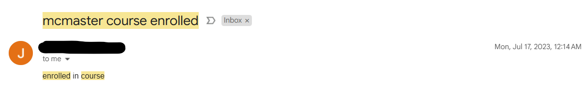
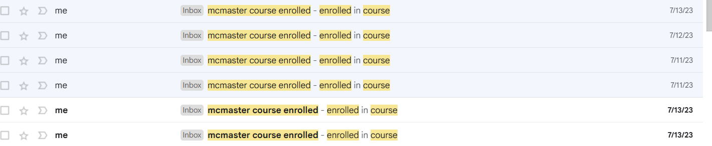

# McMaster Course Seat Bot

## Problem Statement

Course enrollment appointments at McMaster are lottery based (and I don't like to gamble), that is they are randomly assigned to students where some can have earlier or later time slots to enroll in their courses. This of course introduces unfairness and is always a talk of concern during course enrollment time in the summer as there's always cases of students not being able to enroll in the courses they want as they fill up, even if they are required for their degree! Upper year students usually take priority and are able to enroll first so often times you will see lower year courses getting filled up by them since during their time they were not able to enroll in those courses, and the cycle repeats! There does seem to be a waitlist feature shown in Mosaic (McMaster Student Portal) but it does not even work/is disabled.

The only way one can enroll in an otherwise full course is when a seat drops and boy does it get taken fast! (I'm talking a matter of seconds or even less for especially popular 🐦 courses IYKYK!) There are a few services/bots out there (paid/unpaid) that try to help out with this by notifying students when a course opens up. However, a spot is not always guaranteed as trades can happen under the radar which leaves students surprised when they try to enroll literally milliseconds after they get notified. So I decided to take matters into my own hands and whip up my own lil' bot to do exactly this BUT also enroll for me when a spot opens up! Turns out it worked when I received an [email](#image-proofs) around midnight that I got enrolled into a popular course, technically beating my rival competitors out there. It felt great knowing my project finally worked after several [unsuccessful attempts](#image-proofs) to enroll and overall it took a week or so from design and development to actually serving its purpose. Here I am sharing it with you and hope it serves you well too!

## How It Works

The bot is puppeteer JS based which runs in the backgrend (get it), I personally just had it running whenever I was on my laptop and would leave it on idle whenever I wasn't on it. The way it works is that you visit the [McMaster timetable site](https://mytimetable.mcmaster.ca/criteria.jsp) and then choose whichever term the courses are you want to enroll in, then select the courses and copy and paste that URL (now with the courses and term) into `coursesUrl`. The bot will periodically check that page (~30s which aligns with the timetable refresh rate) to see if a spot opens up. Make sure to also edit the code (lines 30-39) accordingly to the courses. It is important to make sure that those same courses you want are already in your shopping cart so the bot can go straight to enrolling in them to minimize clicking around. Fill in `macid` and `password` with your mosaic credentials and set the term selector in the code accordingly. If you wish to also receive an email notification then make sure to hook up whatever email service you use with nodeMailer.

## How to use

Clone the project

```bash
git clone project
```

Install dependencies

```bash
  cd project
  npm install
```

Run bot

```bash
  npm run course
```

## Next Steps

Ideally, I would like to make this more user friendly and perhaps GUI or web app based so non technical folks can use it too and have it running on a server/serverless. The problem is getting students to trust me with their credentials or whether McMaster will allow for SSO/OAuth for this sort of application. The last thing I would want is to get in trouble like that [Washington student](https://www.king5.com/article/tech/university-of-washington-student-conflict-enrollment-innovation/281-366fa191-0392-4433-bdff-42a716b4d92b) for doing something similar.

## Image Proofs



